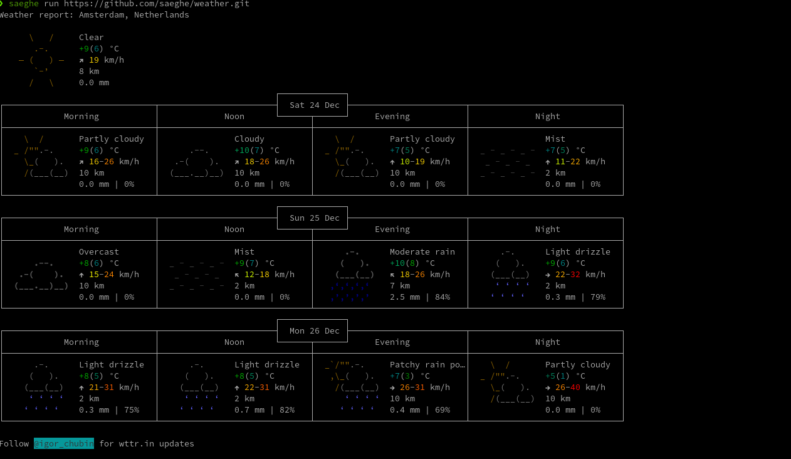

# Weather forecast package

## Introduction

This package is a php package for the weather forecasts. 

This is a sample package for using in the [phpkg](https://phpkg.com)'s `run` command.

### Usages

You can run this package and see the result without installing it using `phpkg`:

```shell
phpkg run https://github.com/php-repos/weather.git
```

Here is a sample output of running it using the `run` command:



If you need to install this package in your application, then you can use phpkg's `add` command:

```shell
phpkg add https://github.com/php-repos/weather.git
```
